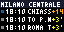

# Trenitalia per Tidbyt

Estensione Tidbyt per visualizzare i treni in partenza da qualsiasi stazione Trenitalia con orari, ritardi in tempo reale e cancellazioni.



## Funzionalità

- **Partenze in tempo reale** da qualsiasi stazione Trenitalia
- **Ritardi aggiornati** ogni 30 secondi con colori:
  - Verde: in orario (OK)
  - Giallo: ritardo < 10 min
  - Arancione: ritardo 10-30 min
  - Rosso: ritardo > 30 min o CANCELLATO
- **Filtro per destinazione** (supporta destinazioni multiple separate da virgola)
- **Filtro per numero treno** specifico
- **Indicatore colorato** per categoria treno (Frecciarossa, Intercity, Regionale, etc.)
- **Paginazione automatica** se mostri più di 3 treni

## Configurazione

| Parametro | Descrizione | Esempio |
|-----------|-------------|---------|
| `station_id` | Codice stazione Trenitalia | `S01700` (Milano Centrale) |
| `station_name` | Nome mostrato nell'header | `Milano Centrale` |
| `destination_filter` | Filtro destinazioni (virgola per multiple) | `TORINO,VENEZIA` |
| `train_number` | Numero treno specifico | `9600` |
| `num_trains` | Numero di treni da mostrare (max 9) | `3` |
| `page_duration` | Secondi per pagina se >3 treni | `5` |

## Testare localmente

### Prerequisiti

1. Installa [Pixlet](https://tidbyt.dev/docs/build/installing-pixlet):
```bash
brew install tidbyt/tidbyt/pixlet
```

### Preview nel browser

```bash
pixlet serve trenitalia.star
# Apri http://localhost:8080
```

### Renderizza GIF

```bash
pixlet render trenitalia.star \
  station_id=S01700 \
  station_name="Milano Centrale" \
  destination_filter="TORINO,VENEZIA" \
  --gif -o preview.gif

open preview.gif
```

### Renderizza con parametri personalizzati

```bash
pixlet render trenitalia.star \
  station_id=S01700 \
  station_name="Milano Centrale" \
  destination_filter="VENEZIA" \
  num_trains=6 \
  page_duration=5
```

## Push sul Tidbyt

### Setup

1. Ottieni Device ID e API Key dall'app Tidbyt:
   - Apri app Tidbyt → Settings → General → Get API Key

2. Esporta le variabili d'ambiente:
```bash
export TIDBYT_DEVICE_ID="your-device-id"
export TIDBYT_API_TOKEN="your-api-key"
```

### Push singolo

```bash
pixlet render trenitalia.star station_id=S01700 station_name="Milano Centrale"
pixlet push $TIDBYT_DEVICE_ID trenitalia.webp
```

### Installazione permanente (nella rotazione)

```bash
pixlet push --installation-id trenitalia $TIDBYT_DEVICE_ID trenitalia.webp
```

## Codici stazione comuni

| Stazione | Codice |
|----------|--------|
| Milano Centrale | `S01700` |
| Milano Porta Garibaldi | `S01645` |
| Milano Cadorna | `S01637` |
| Roma Termini | `S08409` |
| Roma Tiburtina | `S08217` |
| Napoli Centrale | `S09218` |
| Torino Porta Nuova | `S00219` |
| Firenze S.M.N. | `S06004` |
| Bologna Centrale | `S05043` |
| Venezia S. Lucia | `S02593` |

Per trovare il codice della tua stazione, usa l'autocompletamento nell'interfaccia di Pixlet serve, oppure cerca su [ViaggiaTreno](http://www.viaggiatreno.it/).

## Limitazioni

- **Max 9 treni** visualizzabili (3 pagine)
- **API ViaggiaTreno** non ufficiale, potrebbe cambiare
- Lo scroll orizzontale delle destinazioni non funziona quando ci sono più di 3 treni (limitazione di Tidbyt Animation)
- I dati vengono cachati per 30 secondi

## API

Questa estensione utilizza l'API pubblica (non ufficiale) di ViaggiaTreno:
- Base URL: `http://www.viaggiatreno.it/infomobilita/resteasy/viaggiatreno/`
- Endpoint partenze: `/partenze/{codiceStazione}/{dataOra}`
- Endpoint autocomplete: `/autocompletaStazione/{nome}`

## Credits

- Ispirato all'estensione [goodservice](https://github.com/tidbyt/community/tree/main/apps/goodservice) per la metropolitana di New York
- API documentata da [dltmtt/viaggiatreno-api](https://github.com/dltmtt/viaggiatreno-api)

## License

MIT
